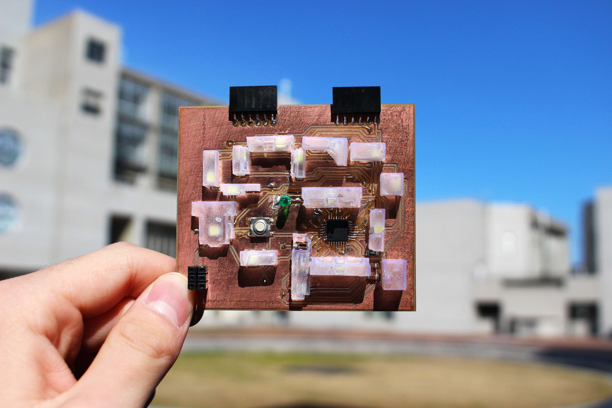
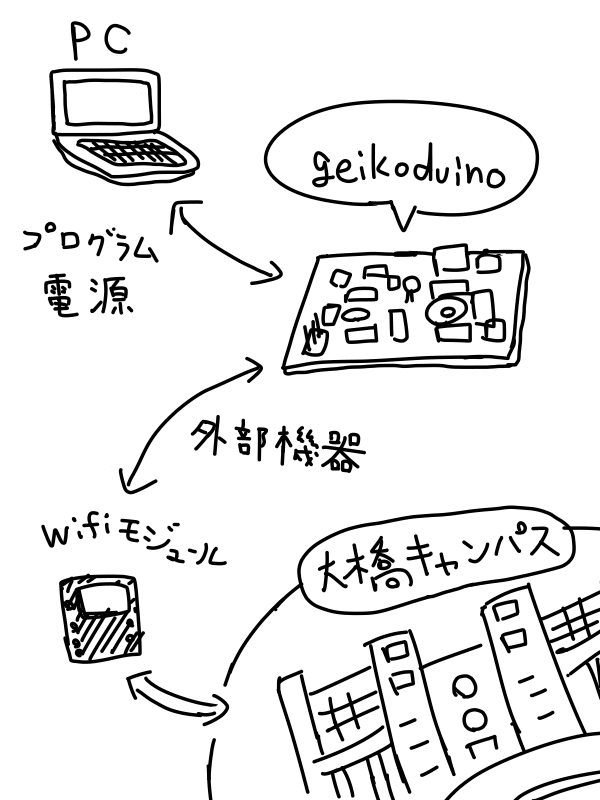

# Geikoduino

Geikoduinoとは、芸術工学部、通称「芸工」がある九州大学大橋キャンパスの構造をモデルとした電子基板である。

Geikoduinoの各パーツはキャンパス内の建物を表しており、Arduinoよろしく自由自在にプログラムを書き込める。いわば、ご当地Arduinoである。プログラム次第では現実の建物との連携も可能だ。もちろんオープンソースである。

パーソナル・ファブリケーションという言葉が提唱されているように、今後個人個人がものづくりをする時代が到来しようとしている中、電子機器において今までのように使用者と内部構造の仕組みとの距離が開いていては、この時代の動きを妨げてしまうのではないか。

単なるブラックボックスを生成するのではなく、制作過程や情報をオープンにした、ものの仕組みを理解しやすい構造が必要になってくるだろう。従来通り、ハードウェアが基板を隠すのではなく、基板自体も理解しやすいようにデザインをする必要性が問われてくるのではないかと考える。

Geikoduino is an electronic circuit board modeled on the architectural structure of the Kyushu University Ohashi campus, which has the faculty of design, commonly known as "Geiko". Each part of Geikoduino represents the buildings on Ohashi campus.
Similar to the Arduino, you can write programs freely. Geikoduino is programmable with the Arduino IDE(Integrated Development Environment). Geikoduino is, so to say, "Local Arduino". Depending on the programs, it is also possible to collaborate with real buildings. It is open source, of course. As the word "personal fabrication" is advocated these years, the movement of individual fabrication is coming. The distance between the user and the internal structure of electric devices should be closer. Instead of just creating a black box, it will be necessary to have a structure that makes it easy to understand any kinds of information such as the process of making. We need to design the electric circuit board so as to make it understand easier, rather than hiding it in the hardware.

作り方の詳細を書いていますので、もし作りたい方がいれば↓こちらを参照してください。

[Geikoduino作り方](https://docs.google.com/document/d/1797HGxrVa2J-ixvMu4QU8xbL5eEkOTaeKWYNoaKOUkQ/edit?usp=sharing)

Geikoduino_prototypeはパーツを本当の部品で作った、プロトタイプのバージョンです。
ソケットをすべてターミナルブロックにしています。

質問があれば今岡まで。